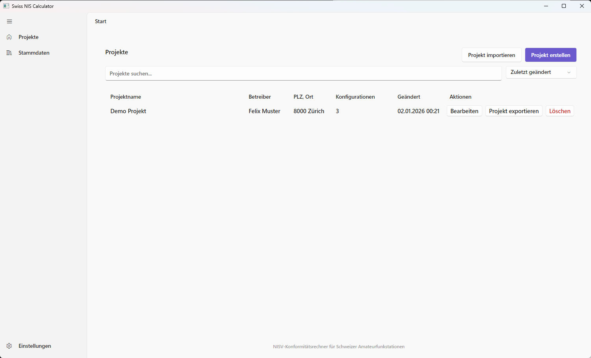
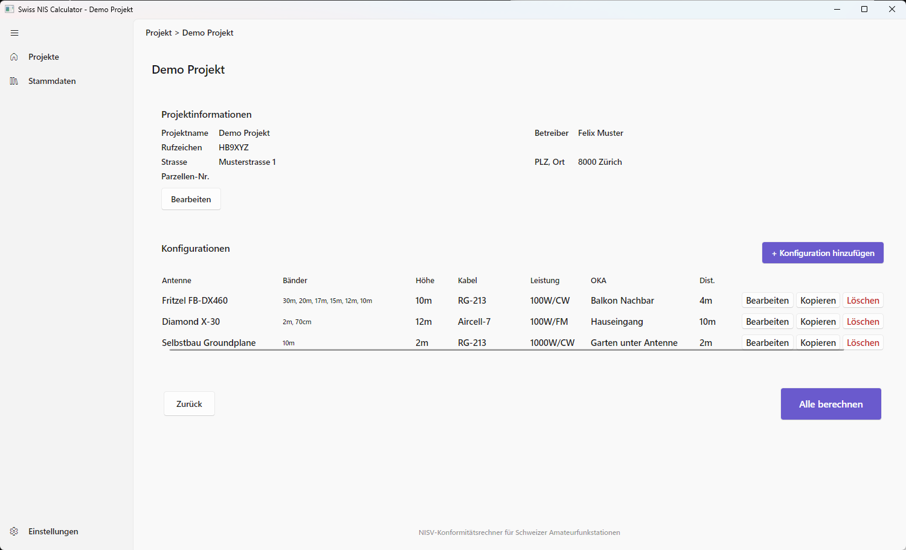
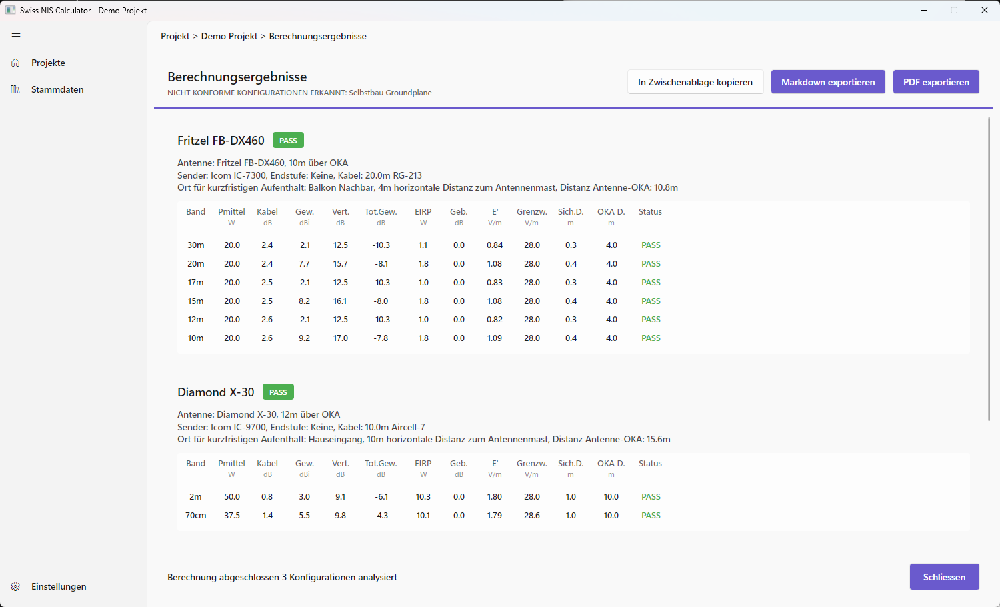
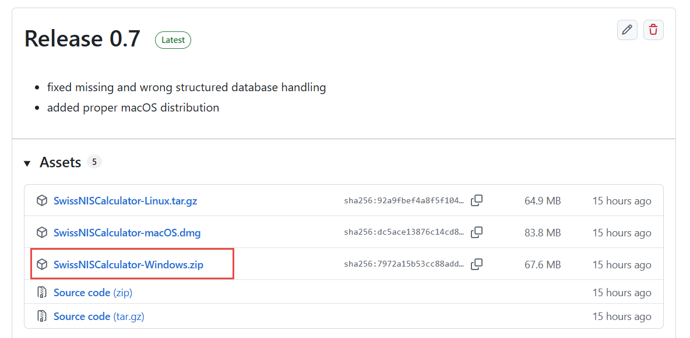
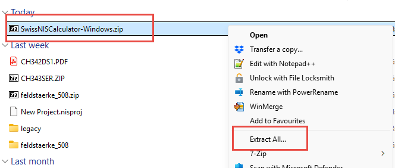
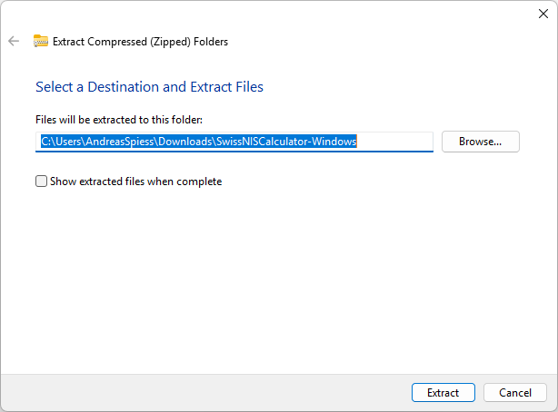
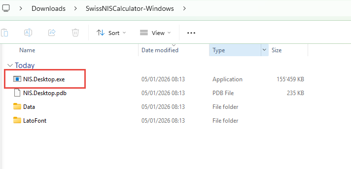

# Swiss NIS Calculator

[](https://github.com/USKAch/Swiss-NIS-Calculator/actions/workflows/build.yml)
[](https://dotnet.microsoft.com/)
[](https://avaloniaui.net/)
[](LICENSE)

[](../../releases)
[](../../releases)
[](../../releases)

> RF field strength calculator for Swiss amateur radio antenna approval (NISV compliance)

## Overview

Swiss NIS Calculator is a modern desktop application for calculating electromagnetic field strength to ensure compliance with Swiss NISV (Verordnung uber den Schutz vor nichtionisierender Strahlung) regulations. It helps amateur radio operators prepare documentation for antenna installation approval.

### Key Features

- **Complete NIS Calculation** - Field strength (V/m), EIRP, ERP, and safety distances
- **Multi-Band Support** - All Swiss amateur bands from 160m to 3cm (1.8 MHz - 10 GHz), including 4m (70 MHz)
- **Antenna Pattern Database** - Vertical radiation patterns with 10-degree resolution, auto-generated from antenna type and gain if not available
- **Cable Loss Calculation** - Frequency-dependent attenuation for common cable types
- **Swiss Limit Compliance** - Automatic verification against NISV limits, per band and per configuration
- **Configuration Variants** - Copy a configuration to quickly create a variant (e.g. with more power)
- **Master Data Management** - Full editors for antennas, cables, radios and evaluation points
- **Project Import/Export** - Share projects via .nisproj files with embedded user master data
- **Reports** - PDF export (one page per configuration with column explanations), Markdown export, copy to clipboard
- **Multi-Language Support** - German, French, Italian, English, or follow the system language

## Screenshots

**Project list** – create, import, export and manage projects



**Project overview** – station data and antenna configurations (edit, copy, delete)



**Results** – per-band field strength, limits and safety distances with PASS/FAIL, export as PDF/Markdown or copy to clipboard



## Installation

### Download Pre-built Binaries

Download the latest release for your platform from [Releases](../../releases):




| Platform | Download |
|----------|----------|
| Windows | `SwissNISCalculator-Windows.zip` |
| macOS | `SwissNISCalculator-macOS.dmg` |
| Linux | `SwissNISCalculator-Linux.tar.gz` |

### Windows
1. Extract the ZIP file

   

   

2. Run `SwissNISCalculator.exe`

   

### macOS
1. Open the downloaded DMG
2. Drag `SwissNISCalculator.app` to `Applications` (recommended). If you run directly from the DMG, the app stores its data under `~/Library/Application Support/SwissNISCalculator` because the DMG volume is read-only.
3. Launch the app (you may need to allow it in Security & Privacy settings)

### Linux
1. Extract: `tar -xzvf SwissNISCalculator-Linux.tar.gz`
2. Make executable: `chmod +x SwissNISCalculator`
3. Run: `./SwissNISCalculator`

### Build from Source

```bash
# Clone the repository
git clone https://github.com/USKAch/Swiss-NIS-Calculator.git
cd Swiss-NIS-Calculator

# Build
dotnet build

# Run
dotnet run --project src/NIS.Desktop

# Publish for your platform
dotnet publish src/NIS.Desktop -c Release -r win-x64 --self-contained
dotnet publish src/NIS.Desktop -c Release -r osx-x64 --self-contained
dotnet publish src/NIS.Desktop -c Release -r linux-x64 --self-contained
```

### Data & Export Locations
- **Windows & Linux**: the app is fully portable. All mutable files (database, settings, `Data/Export` for Markdown/PDFs) stay next to the executable inside the extracted folder.
- **macOS (installed)**: after dragging the app to `/Applications`, data and exports remain inside `SwissNISCalculator.app/Contents/MacOS/Data`.
- **macOS (running directly from the DMG)**: the app copies `Data/` to `~/Library/Application Support/SwissNISCalculator/Data` and writes exports there (`~/Library/Application Support/SwissNISCalculator/Data/Export`) because the mounted DMG is read-only.

## Usage

### Quick Start

1. **Create a Project** - Enter station details (operator, callsign, street, ZIP/city, optional parcel number)
2. **Add Antenna Configuration** - Select radio, cable, and antenna from master data; add an amplifier if used
3. **Set Evaluation Point** - Choose the place of short-term stay (OKA/LSM/LST/PSS depending on language) with its distance and building damping
4. **Calculate** - View field strength results and compliance status per band
5. **Export** - PDF or Markdown report, or copy the report to the clipboard
6. **Variants** - Use *Copy* on a configuration to create a second variant, e.g. with more power

The navigation pane has three entries: **Projects**, **Master Data** and **Settings**. Everything else (configurations, calculation, reports) lives inside the project.

### Import/Export Projects

Share station configurations with other users via .nisproj files:

- **Export** - Button on each row of the project list; saves the project to a portable .nisproj file (includes user-specific master data)
- **Import Project** - Button next to *Create Project* in the project list; loads a .nisproj file (creates missing master data automatically)

### Master Data Management

Open **Master Data** from the navigation pane to:

- **Antennas** - Add/edit antennas with bands, gain and vertical radiation patterns (auto-generated on request)
- **Cables** - Add/edit cables with frequency-dependent attenuation tables
- **Radios** - Add/edit transmitter specifications, optionally with band-specific power
- **Evaluation Points** - Places of short-term stay with default distance and building damping

Shipped master data is read-only; use *Copy* to create an editable variant.

### Settings

- **Theme** - System / Light / Dark
- **Language** - System / Deutsch / Français / Italiano / English
- **About** - Version and credits

### Factory Mode (maintainers)

Start the app with `--factory` to edit the shipped master data, constants, modulations and bands, and to export/import the complete factory data set:

```bash
NIS.Desktop.exe --factory
# or during development
dotnet run --project src/NIS.Desktop -- --factory
```

There is no separate menu entry; with the switch, *Master Data* opens in factory mode (red indicator). See the [Functional Specification](docs/NIS_fsd.md), section 9.

## Technical Details

### Calculation Formulas

```
Mean Power:        Pm = P x AF x MF
Attenuation:       A = 10^(-a/10)
Gain Factor:       G = 10^(g/10)
Field Strength:    E = 1.6 x sqrt(30 x Pm x A x G x AG) / d
Safety Distance:   ds = 1.6 x sqrt(30 x Pm x A x G x AG) / EIGW
```

### Swiss NISV Limits

| Frequency | Limit (V/m) |
|-----------|-------------|
| 1.8 MHz   | 64.7        |
| 3.5 MHz   | 46.5        |
| 7 MHz     | 32.4        |
| 10-28 MHz | 28.0        |
| 50 MHz    | 28.0        |
| 70 MHz    | 28.0        |
| 144 MHz   | 28.0        |
| 432 MHz   | 28.6        |
| 1240 MHz  | 48.5        |
| 2300+ MHz | 61.0        |

## Project Structure

```
Swiss-NIS-Calculator/
+-- src/
|   +-- NIS.Desktop/           # Avalonia UI application
|       +-- Calculations/      # Field strength calculator, NISV limits, pattern generator
|       +-- Converters/        # XAML value converters (band names, compliance colors)
|       +-- Localization/      # Multi-language support (Strings.cs)
|       +-- Models/            # Data models
|       +-- Services/          # Database, repositories, settings, master data, PDF export
|       +-- ViewModels/        # MVVM ViewModels
|       +-- Views/             # XAML Views
|       +-- Data/              # Shipped SQLite database
+-- docs/                      # Functional specification, formulas
+-- scripts/                   # Database migration script
+-- tests/                     # xUnit tests
+-- legacy/                    # Original VB6 source (reference)
```

## Technology Stack

| Component | Technology |
|-----------|------------|
| Framework | .NET 8.0 |
| UI | Avalonia UI 11.x |
| Architecture | MVVM (CommunityToolkit.Mvvm) |
| Database | SQLite (Dapper) |
| PDF Export | QuestPDF |

## Documentation

- [Functional Specification](docs/NIS_fsd.md) - Detailed feature specification
- [Calculation Formulas](docs/nis-formulas.md) - NIS formulas reference

## Versioning & Releases

The version is the nearest git tag, a plain number such as `0.9` or `1.0`. A release is built by running the *Build and Release* workflow with the version as input; it builds Windows, macOS and Linux packages, stamps them with that version and creates the tag. Local builds show the last tag.

## Contributing

Contributions are welcome! Please feel free to submit a Pull Request.

1. Fork the repository
2. Create your feature branch (`git checkout -b feature/AmazingFeature`)
3. Commit your changes (`git commit -m 'Add some AmazingFeature'`)
4. Push to the branch (`git push origin feature/AmazingFeature`)
5. Open a Pull Request

## License

This project is licensed under the MIT License - see the [LICENSE](LICENSE) file for details.

## Acknowledgments

- Original VB6 application by HB9ZS
- Further development on behalf of [USKA](https://www.uska.ch/) by Andreas Spiess, HB9BLA
- Swiss NISV regulations and calculation methodology
- [Avalonia UI](https://avaloniaui.net/) for the cross-platform UI framework

## Contact

For questions or support, please open an issue on GitHub.

---

Made with :heart: for the amateur radio community
