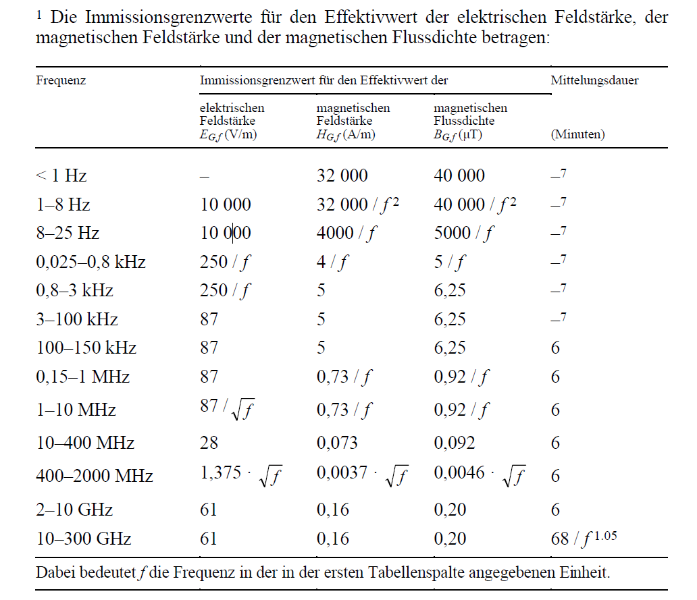

# NIS Formulas (NISV law vs. VB6 legacy)

This note summarizes the electric field limits from NISV Annex 2, Ziff. 11 and the
field-strength formulas currently implemented from the VB6 legacy code.

## NISV Annex 2, Ziff. 11 (Immissionsgrenzwerte fuer Feldgroessen)

- 0.15-1 MHz: E_{G,f} = 87
- 1-10 MHz: E_{G,f} = 87 / f
- 10-400 MHz: E_{G,f} = 28
- 400-2000 MHz: E_{G,f} = 1.375 * sqrt(f)
- 2-10 GHz: E_{G,f} = 61
- 10-300 GHz: E_{G,f} = 61

Notes:
- f is in MHz for the MHz/GHz ranges above.
- The complete Annex 2 table also defines limits for < 1 Hz through 150 kHz and
  pulsed fields (EP,f). Only the E_{G,f} values relevant to the project bands are
  listed here.

## VB6 Limits vs Law (E_{G,f})

Comparison for the standard amateur bands used by the legacy code.

| Frequency (MHz) | VB6 Limit (V/m) | Law E_{G,f} (V/m) | Law Formula     | Match |
| --------------: | --------------: | ----------------: | --------------- | ----- |
|             1.8 |            64.7 |             48.33 | 87 / f          | FAIL  |
|             3.5 |            46.5 |             24.86 | 87 / f          | FAIL  |
|             7.0 |            32.4 |             12.43 | 87 / f          | FAIL  |
|            10.0 |              28 |                28 | 28              | OK    |
|            14.0 |              28 |                28 | 28              | OK    |
|            18.0 |              28 |                28 | 28              | OK    |
|            21.0 |              28 |                28 | 28              | OK    |
|            24.0 |              28 |                28 | 28              | OK    |
|            28.0 |              28 |                28 | 28              | OK    |
|            50.0 |              28 |                28 | 28              | OK    |
|           144.0 |              28 |                28 | 28              | OK    |
|           432.0 |            28.6 |             28.58 | 1.375 * sqrt(f) | OK    |
|          1240.0 |            48.5 |             48.42 | 1.375 * sqrt(f) | OK    |
|          2400.0 |              61 |                61 | 61              | OK    |
|          5650.0 |              61 |                61 | 61              | OK    |
|         10000.0 |              61 |                61 | 61              | OK    |

Notes:

- Law values use Annex 2, Ziff. 11 (electric field limit E_{G,f}). f is in MHz.
- Law values are rounded to 2 decimals for display.

## Field strength calculation (VB6 legacy formulas)

Constants:
- kr = 1.6 (ground reflection factor)
- 30.0 (free-space constant)
- 1.64 (EIRP to ERP conversion)

Inputs:
- P: transmitter power in W
- AF: activity factor
- MF: modulation factor
- a1: cable/line loss in dB
- a2: additional loss in dB
- g1: antenna gain in dBi
- g2: vertical angle attenuation in dB
- ag: building damping in dB
- d: distance in m

Formulas (each heading includes a short description):

### Pm (mean power at transmitter output)
Pm = P * AF * MF
Origin: time-averaged transmitter power.
Assumptions: AF and MF model duty cycle/modulation as linear multipliers.

### a (total attenuation in dB)
a = a1 + a2
Origin: cascaded losses add in dB.
Assumptions: independent linear power losses.

### g (total antenna gain in dB)
g = g1 - g2
Origin: gain minus pattern attenuation at the evaluation angle.
Assumptions: attenuation is applied as a power loss in dB; polarization effects are ignored.

### A (linear attenuation factor)
A = 10^(-a / 10)
Origin: dB to linear power ratio conversion.
Assumptions: a is a power loss (not voltage) in dB.

### G (linear antenna gain factor)
G = 10^(g / 10)
Origin: dB to linear gain conversion.
Assumptions: g is power gain referenced to isotropic (dBi).

### EIRP (equivalent isotropically radiated power)
EIRP = Pm * A * G
Origin: definition of EIRP as input power times linear gain and losses.
Assumptions: far-field gain model applies to mean power.

### ERP (effective radiated power, dipole reference)
ERP = EIRP / 1.64
Origin: conversion from isotropic to half-wave dipole reference (1.64 = 2.15 dB).
Assumptions: dipole reference is required for reporting; same propagation conditions as EIRP.

### AG (linear building damping factor)
AG = 10^(-ag / 10)
Origin: dB to linear power ratio conversion for building loss.
Assumptions: building loss applies as a multiplicative power attenuation.

### E (electric field strength at distance d)
E = kr * sqrt(30 * Pm * A * G * AG) / d
Origin: plane-wave far-field relation E = sqrt(30 * EIRP) / d with a ground reflection factor.
Assumptions: far-field, free-space plane wave, single empirical reflection factor kr.

### S (power density)
S = E^2 / 377
Origin: plane-wave Poynting relation with free-space impedance (377 ohm).
Assumptions: plane-wave in free space; E and H are orthogonal and in phase.

### ds (safety distance at E_{G,f})
ds = kr * sqrt(30 * Pm * A * G * AG) / E_{G,f}
Origin: algebraic solution of the E-field equation for distance at the limit.
Assumptions: same as E; E_{G,f} is the applicable regulatory limit for the frequency.
